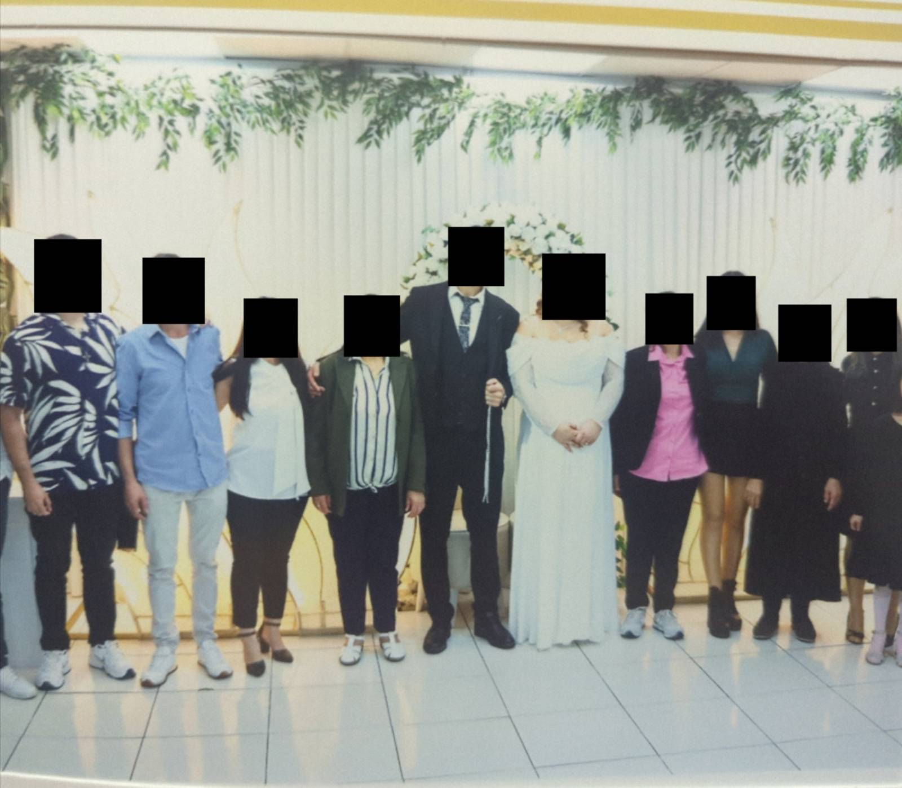

# PixelCloak

## A tool that enhances privacy of pictures for Android

## Description:

PixelCloak helps protect people’s privacy by making it harder for automated systems to link or track photos through reverse image search, while keeping the image visually almost identical to the original. It introduces subtle, high-frequency perturbations—tiny texture, noise, and compression changes—that preserve the overall look and quality of the picture but disrupt the mathematical “fingerprints” that search engines and recognition algorithms rely on to find duplicates online. It also automatically censors detected faces and removes all embedded EXIF metadata to further prevent identification and tracing through image files.

## Features:

- No permissions required

- Reduces effectiveness of hash-based detection

- Removes EXIF metadata

- Censors any detected faces in picture

- Written in Java

## Installation:

### Option 1:

Download the latest APK from the [Releases Section](https://github.com/umutcamliyurt/PixelCloak/releases/latest).

### Option 2:

Build it yourself using [Android Studio](https://developer.android.com/studio).

## PixelCloaked image:

    

## License

Distributed under the MIT License. See `LICENSE` for more information.